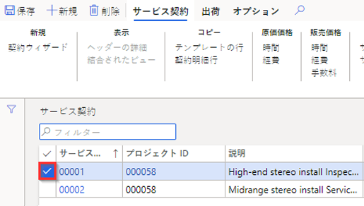
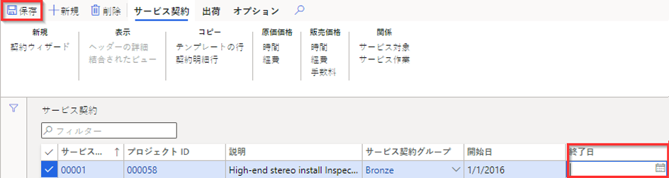

---
lab:
    title: 'ラボ 7: 計画された作業指示書の作成'
    module: 'モジュール 1: Microsoft Dynamics 365 Supply Chain Management の基礎を学ぶ'
---

## ラボ 7 - 計画された作業指示書の作成

## 目的

資産に必要なメンテナンスまたは修理を説明し、メンテナンス要求を完了するための適切なリソースを割り当てる、システムに配置されたメンテナンスの指示書。あなたの会社は継続ちゅうのサービス契約があり、計画したサービス注文が作成され、契約したアイテムについて予定されているサービス履行を支持可能なようにする必要があります。

## ラボの設定

   - **「推定時間」**: 10 分

## 手順

1. Finance and Operations の「ホーム」ページの右上で、USMF 社の作業を行っていることを確認します。

1. 必要な場合、会社を選び、メニューから **USMF** を選択します。

1. 左側のナビゲーション ペインで、**「モジュール」** > **「サービス管理」** > **「サービス契約」** > **「サービス契約」** を選択します。

1. 最初のサービス契約の最初の列のチェック ボックスを選択します。

    

1. **「終了日」** ボックスを選択して現在の値を削除し、上部メニューの **「保存」** を選択します。  
 終了日が削除され、この契約に対して新しいサービス注文を作成できます。

    

1. 上部メニューで **「納品」** を選択します。

1. リボン メニューの **「作成」** の下にある **「計画済のサービス注文」** を選択します。

1. 「サービス注文の作成」ペインの **「期間」** で、**「開始日」** を今日の日付に、**「終了日」** を本日から 2 日後に設定します。

1. **「情報ログ」** で、**「情報ログの表示」** を選択し、トグル スイッチを **「はい」** に設定します。  
こうすることで、契約で作成されたサービス注文の一覧が表示されます。

1. **「トランザクション タイプを含める」** で、**「時間」** を選択し、トグル スイッチを **「はい」** に設定します。  
トランザクション タイプはサービス契約で作成された行を表現したものであり、選択したトランザクション タイプ毎にサービス契約行で指定したサービス間隔に応じていくつかのサービス注文を生成します。

1. **「オプション」** で、**「継続」** を選択し、トグル スイッチを **「はい」** に設定します。  
これを使用して、継続的な一連のサービス注文から漏れているサービス注文を作成します。

1. **「OK」** を選択します。
